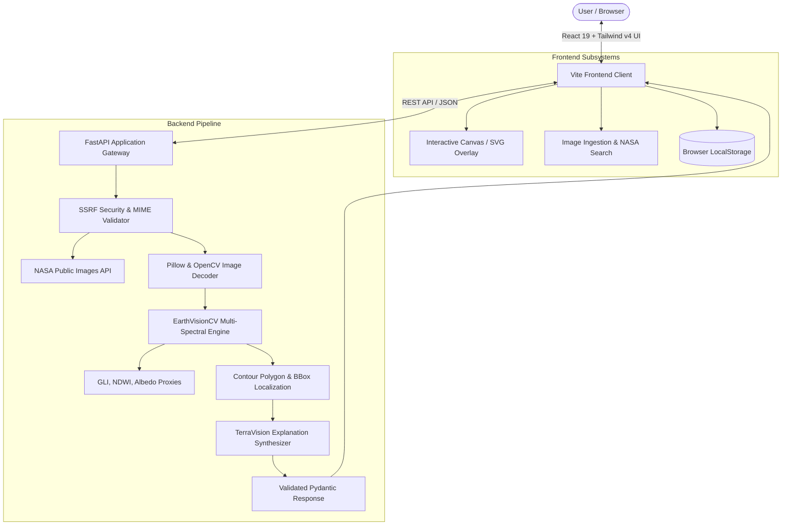

# SpaceSnap / TerraVision AI — Explore Earth Through Intelligence

> *"See our planet differently. Understand it intelligently."*

[](https://spaceappschallenge.org)
[](#discord-submission-template)
[](https://python.org)
[](https://fastapi.tiangolo.com)
[](https://react.dev)
[](https://vitejs.dev)
[](https://opencv.org)
[](LICENSE)

---

## 1. Project Overview & Problem Statement

Every day, Earth-observation satellites—including NASA's Terra, Aqua, Suomi NPP, Landsat 8/9, and astronauts aboard the International Space Station (ISS)—capture petabytes of multispectral imagery documenting our planet. These images record dynamic atmospheric cyclogenesis, glacial calving fronts, wildfire smoke palls, oceanic phytoplankton blooms, and expanding human settlements.

However, non-specialists, students, educators, and disaster responders face substantial hurdles:
- **Visual ambiguity**: Complex light reflectance patterns are hard to identify without remote sensing expertise.
- **Lack of localization**: Raw satellite images lack precise spatial annotations pointing out specific features.
- **Jargon overload**: Scientific descriptions are often impenetrable to the general public.

**SpaceSnap (TerraVision AI)** is a full-stack, AI-powered Earth and space observation application built for the **NASA Space Apps AI Challenge**. It delivers an intuitive, end-to-end journey:

$$\text{Select Image} \longrightarrow \text{AI Multi-Spectral Analysis} \longrightarrow \text{Spatial Feature Localization} \longrightarrow \text{Synchronized Annotations} \longrightarrow \text{Simple-Language Explanation}$$

---

## 2. Key Features

- **End-to-End Analysis Pipeline**: Ingests imagery, runs optical multi-spectral computer vision, identifies $\ge 3$ distinct features, draws synchronized bounding boxes and polygon overlays, and generates accessible scientific explanations.
- **Four Flexible Image Ingestion Methods**:
  1. **Curated NASA Benchmark Gallery**: 8 verified Earth and Space observations with exact coordinates, sensor packages, capture dates, and authoritative metadata.
  2. **NASA Image & Video Library Search**: Live proxy client querying `https://images-api.nasa.gov` with instant topic suggestions (*Hurricane*, *Earth from space*, *Wildfire*, *Amazon*, *Arctic ice*, *Volcano*).
  3. **Drag-and-Drop Image Upload**: Multi-format support (JPG, PNG, WEBP) with server-side MIME type verification and 20MB payload bounds.
  4. **Public Image URL**: Remote image ingestion protected by strict SSRF filters blocking private subnets, loopbacks (`127.0.0.1`), link-local IPs, and cloud metadata endpoints (`169.254.169.254`).
- **Multi-Spectral Computer Vision Engine (`EarthVisionCV`)**:
  - **Normalized Green Leaf Index (GLI)**: Optical proxy for NDVI isolating photosynthetic canopy from bare soil.
  - **Blue-to-Red Radiance Attenuation**: Marine absorption ratio distinguishing deep pelagic water from coastal sediment.
  - **HSV Albedo Thresholding**: Isolates high-reflectance cloud convective tops from ice sheets.
  - **Canny/Sobel Edge Density**: Captures rectilinear urban development and road infrastructure grids.
  - **Circular Hough Transforms**: Identifies concentric impact craters, volcanic calderas, and dome rings.
- **Interactive High-Resolution Visualization Viewer**:
  - HTML5 Canvas and scalable SVG overlays mapped with normalized coordinates $[0.0, 1.0]$.
  - **3 Viewing Modes**: Annotated View, Original View, and Side-by-Side Split View with an interactive slider.
  - **Bidirectional Sync**: Hovering/clicking a bounding box highlights the matching card in the right panel and vice-versa.
  - Full Zoom-in, Zoom-out, Pan/Drag, and Reset View matrix controls.
  - Category layer visibility filters (toggle clouds, oceans, vegetation, etc.).
  - Direct export actions: Download Annotated PNG and Download Structured Analysis JSON.
- **Accessible Simple-Language Explanations**:
  - *1. What am I looking at?* (Overview of visible radiance & scene context)
  - *2. What was detected?* (Localized features with area percentages)
  - *3. What is happening?* (Cautious scientific interpretation of visible dynamics)
  - *4. Why does it matter?* (Real-world environmental/scientific significance)
  - *5. How certain is the analysis?* (Honest evaluation of confidence & sensor resolution)
  - *6. Scientific Limitations* (Explicit boundaries on what optical snapshots cannot infer)
- **Local Analysis History**: Automatically caches previous analyses in browser `localStorage` with thumbnail previews, timestamps, and one-click reopening.
- **Scientific Restraint**: Transparent confidence scoring and explicit labeling of benchmark demo results versus live pixel inferences.

---

## 3. System Architecture



---

## 4. Technology Stack

| Layer | Technologies & Dependencies | Purpose |
|---|---|---|
| **Frontend** | React 19, TypeScript, Vite 8, Tailwind CSS v4, Lucide React | High-performance responsive scientific UI, glassmorphism, glowing telemetry badges, and scanline shaders |
| **Visualization** | HTML5 Canvas, Scalable Vector Graphics (SVG) | Spatial bounding boxes, polygon contours, normalized scale transformation |
| **Backend** | Python 3.12, FastAPI 0.142.2, Uvicorn, Pydantic v2 | High-throughput asynchronous REST API and data validation |
| **Computer Vision** | OpenCV (`cv2`) 5.0.0, Pillow 10.0, NumPy 2.5 | Multi-spectral proxy indexing (GLI, NDWI, HSV Albedo), contour extraction, morphological filters, Canny/Hough transforms |
| **Networking & APIs** | HTTPX, NASA Image & Video Library API (`images-api.nasa.gov`) | Public imagery retrieval, secure remote fetching, SSRF DNS validation |
| **Testing** | Pytest, HTTPX TestClient | Automated backend unit testing and end-to-end smoke verification |

---

## 5. Curated NASA Benchmark Registry

| ID | Title | Mission / Sensor | Source Organization | Coordinates |
|---|---|---|---|---|
| `sample-hurricane-surigae` | Super Typhoon Surigae in the Western Pacific | Suomi NPP / VIIRS | NASA Earth Observatory | 13.5° N, 130.2° E |
| `sample-amazon-deforestation` | Confluence of Amazon and Tapajos Rivers | Space Shuttle STS-43 | NASA Space Shuttle Earth Obs | 2.4° S, 54.7° W |
| `sample-barents-phytoplankton` | Phytoplankton Bloom off Newfoundland | Terra / MODIS | NASA Goddard Space Flight Center | 48.2° N, 51.5° W |
| `sample-wildfire-smoke` | California Wildfires and Smoke Plumes | ISS Expedition 71 | NASA International Space Station | 40.5° N, 122.1° W |
| `sample-pine-island-glacier` | Khurdopin Glacial Ice and Moraines | Terra / ASTER | NASA Jet Propulsion Laboratory | 36.2° N, 75.4° E |
| `sample-richat-structure` | The Richat Structure ('Eye of the Sahara') | Terra / ASTER | NASA Goddard Space Flight Center | 21.1° N, 11.4° W |
| `sample-las-vegas-expansion` | Urban Grid of the Las Vegas Basin | Terra / ASTER | NASA Jet Propulsion Laboratory | 36.1° N, 115.1° W |
| `sample-kilauea-volcano` | Kilauea Active Lava Flows and Fissures | Terra / ASTER | NASA Jet Propulsion Laboratory | 19.4° N, 155.2° W |

---

## 6. Quickstart & Installation

### Prerequisites
- Node.js 18+ and npm
- Python 3.10+
- Git

### 1. Clone the Repository
```bash
git clone https://github.com/zaimfazal/SpaceSnap---AINASA-Space-Apps-AI-Challenge.git
cd SpaceSnap---AINASA-Space-Apps-AI-Challenge
```

### 2. Backend Setup
```bash
cd backend
python -m pip install -r requirements.txt
python -m uvicorn app.main:app --port 8000 --host 127.0.0.1
```
*The backend API will be available at `http://127.0.0.1:8000` with interactive Swagger docs at `http://127.0.0.1:8000/docs`.*

### 3. Frontend Setup
In a new terminal:
```bash
cd frontend
npm install
npm run dev
```
*The application interface will be live at `http://localhost:5173`.*

---

## 7. Running Tests

### Backend Unit Tests
```bash
cd backend
python -m pytest tests/test_backend.py -v
```
*Verifies `/api/health`, `/api/images/samples`, `/api/models/status`, and live multi-spectral detection on synthetic scenes.*

### End-to-End Integration Smoke Test
```bash
python backend/tests/e2e_smoke_test.py
```
*Validates all 6 API endpoints, live pixel CV inference, NASA library searches, and Pydantic response schemas.*

---

## 8. Sample Analysis Output

```json
{
  "image_title": "Super Typhoon Surigae in the Western Pacific",
  "analysis_status": "success",
  "analysis_mode": "curated_ground_truth",
  "model_used": "NASA Earth Observatory Benchmark (Verified Ground Truth)",
  "is_demo_analysis": true,
  "features": [
    {
      "id": "gt-surigae-1",
      "name": "Well-Defined Eye of the Cyclone",
      "category": "storms",
      "confidence": 0.98,
      "description": "Clear, cloud-free central stadium-effect eye of Category 5 Super Typhoon Surigae.",
      "bbox": { "x": 0.44, "y": 0.42, "width": 0.12, "height": 0.12 },
      "area_percentage": 2.4,
      "color": "#0284c7",
      "evidence_type": "curated_ground_truth"
    }
  ],
  "summary": "Analysis of 'Super Typhoon Surigae' successfully resolved 4 distinct visible features.",
  "explanation": {
    "what_am_i_looking_at": "This satellite observation displays extensive atmospheric cloud systems over the Philippine Sea.",
    "what_was_detected": [
      "Well-Defined Eye of the Cyclone (Storms): covers approx 2.4% of the frame",
      "Intense Eyewall Convection Ring (Clouds): covers approx 18.5% of the frame"
    ],
    "what_is_happening": "Dense convective cloud masses are circulating above the ocean surface, reflecting high solar radiation.",
    "why_does_it_matter": "Tracking storm eye geometry and cloud wall symmetry informs cyclone intensity modeling.",
    "how_certain_is_analysis": "The optical feature boundaries show an estimated confidence of approximately 96%.",
    "what_cannot_be_determined": [
      "Exact wind speeds and central pressure cannot be measured from visible optical bands alone.",
      "Future trajectory requires predictive numerical weather prediction models."
    ]
  },
  "processing_time_ms": 210.4
}
```

---

## 9. Submission Methodology Explanation (142 Words)

> SpaceSnap / TerraVision AI bridges the gap between raw orbital Earth observations and public accessibility through an end-to-end computer vision pipeline. The system ingests satellite imagery from curated NASA collections, the public NASA Image and Video Library API, or user uploads with strict SSRF validation. Images are preprocessed and analyzed using the EarthVisionCV engine, which derives multi-spectral optical proxies including the Normalized Green Leaf Index (GLI), Blue-to-Red oceanic attenuation, and HSV albedo thresholds. Connected-component contours and Douglas-Peucker approximations extract spatial bounding boxes and segmentation masks for visible features. A synthesis engine then translates localized spatial data into a six-part plain-language explanation detailing feature interactions, environmental significance, and analytical certainty. The system exercises strict scientific restraint by declaring optical limitations—avoiding speculative causal claims regarding subsurface geology, live combustion thermal dynamics, or unmodeled weather trajectories.

---

## 10. Discord Submission Template

```markdown
🚀 **SpaceSnap (TerraVision AI) — Explore Earth Through Intelligence** #evn-sp-ai

**Tagline:** "See our planet differently. Understand it intelligently."
**Track:** NASA Space Apps Challenge — Earth & Space Observation AI Explorer

**Overview:**
SpaceSnap transforms complex NASA satellite imagery into accessible, spatially localized features and plain-language scientific explanations for non-experts, researchers, and students.

**Key Features Implemented:**
🛰️ **Multi-Spectral Computer Vision Engine**: OpenCV-powered optical proxy segmentation (GLI vegetative canopy, marine blue-to-red attenuation, HSV albedo for storms/cryosphere, Canny edge grids for urban land use, and Hough circular transforms for craters/calderas).
🎯 **Interactive Dual-Layer Viewer**: Canvas & SVG synchronized overlays, Side-by-Side split comparison with interactive slider, zoom/pan controls, and bidirectional hover/click card highlighting.
💬 **6-Part Simple-Language Explanations**: Accessible breakdowns answering What am I looking at?, What was detected?, What is happening?, Why does it matter?, How certain is the analysis?, and Scientific Limitations.
🔍 **NASA Multi-Source Ingestion**: 8 verified Earth Observatory benchmark samples, live search integration with the public NASA Image & Video Library API (`images-api.nasa.gov`), multi-format file uploads (JPG/PNG/WEBP) with MIME validation, and SSRF-protected URL loading.
📁 **Client History & Exports**: Local browser history persistence with instant reload, annotated PNG export, and machine-readable Pydantic JSON export.

**Tech Stack:** React 19, TypeScript, Vite 8, Tailwind CSS v4, Lucide React, Python 3.12, FastAPI, Uvicorn, OpenCV 5, Pillow, NumPy, Pytest.

**Repository:** https://github.com/zaimfazal/SpaceSnap---AINASA-Space-Apps-AI-Challenge.git
```

---

## 11. Documentation Links

- [System Architecture](docs/architecture.md)
- [Dataset Sources & NASA Attribution](docs/dataset-sources.md)
- [Model Card](docs/model-card.md)
- [Live Presentation & Demo Guide](docs/demo-guide.md)

---

## 12. License & Attribution

This project is open-source under the [MIT License](LICENSE). All satellite imagery is courtesy of NASA (National Aeronautics and Space Administration), USGS (United States Geological Survey), and the Earth Science Data and Information System (ESDIS).
