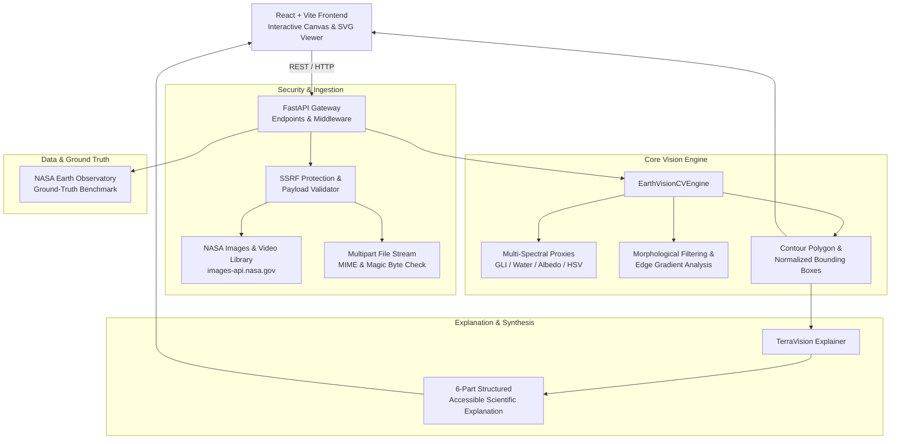

# TerraVision AI — System Architecture

## Overview
TerraVision AI is an end-to-end Earth and space observation system designed for scientific exploration, feature detection, spatial localization, and accessible natural-language explanations.

## Architecture Layers

### 1. Presentation Layer (Frontend)
- **Framework**: React 19 + TypeScript + Vite 8
- **Styling**: Tailwind CSS v4 with bespoke scientific dark-space aesthetics, glassmorphism, glowing telemetry badges, and scanline shaders.
- **Interactive Visualization**:
  - HTML5 Canvas & synchronized SVG overlay system.
  - Normalized coordinate mapping `[0.0, 1.0]` independent of screen resolution, viewport aspect ratios, or zoom scales.
  - Two-way interactive sync: Hovering/clicking a bounding box highlights corresponding feature card and vice-versa.
  - Split-view comparison slider (Original vs Annotated) and full-frame zoom/pan matrix.

### 2. Service & API Layer (Backend)
- **Framework**: Python 3.12 + FastAPI + Uvicorn
- **Validation**: Strict Pydantic v2 schemas for all payloads and responses.
- **Security**:
  - DNS resolution check ensuring public URLs cannot point to private subnets, loopbacks (`127.0.0.1`), metadata endpoints (`169.254.169.254`), or reserved CIDRs.
  - Enforced 20MB file limit and streaming size aborts.

### 3. Computer Vision & Feature Detection
- **Multi-Spectral Proxy Indexing**:
  - *Green Leaf Index (GLI)*: `(2*G - R - B) / (2*G + R + B + ε)` as an optical proxy for NDVI.
  - *Water Absorption Ratio*: Blue-to-Red band radiance ratio for pelagic ocean and lake localization.
  - *Atmospheric Albedo & HSV Thresholding*: Separates high-reflectance cloud convective tops from ice sheets.
  - *Texture & Edge Gradient Analysis*: Canny and Sobel edge density filters identifying rectilinear urban development grids and road networks.
  - *Circular Hough Transforms*: Geometric localization of impact craters, volcanic calderas, and circular dome structures.

### 4. Grounded Simple-Language Explanation Framework
Adheres to strict scientific restraint:
1. **What am I looking at?**: Plain overview of optical radiance and scene context.
2. **What was detected?**: Bullet points of localized features with approximate spatial coverage.
3. **What is happening?**: Cautious interpretation of visible spatial interfaces.
4. **Why does it matter?**: Environmental and scientific significance.
5. **How certain is the analysis?**: Calibrated confidence based on contour solidity and radiometric contrast.
6. **Scientific Limitations**: Explicit declarations of what visible optical spectrum cannot determine (e.g. wind speeds, barometric pressure, subterranean geology, or active flame fronts).
